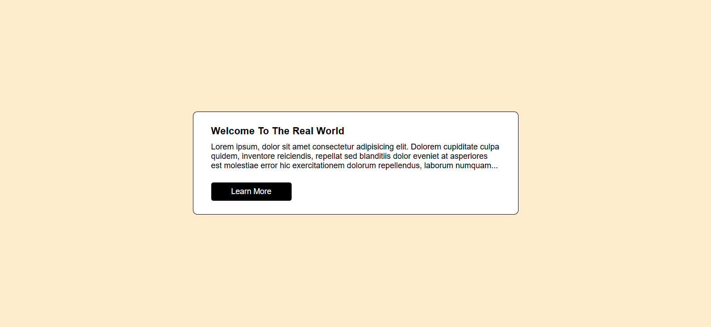

# Interactive Content Toggle (Learn More Button Project)

---

## 📖 Overview
This is a simple web project built using **HTML**, **CSS**, and **JavaScript**. It allows users to toggle the visibility of additional content by clicking a button. The project demonstrates basic **DOM manipulation**, **class toggling**, and **event handling** in JavaScript.

---

## 🚀 Features
- Clean and simple design.
- A "Learn More" button that reveals hidden text when clicked.
- Uses `classList.toggle()` for smooth state management.
- Beginner-friendly example of interactive web content.

---

## 🧠 How It Works
1. The page displays an introductory paragraph.
2. A second paragraph (inside `.content-container-2`) is initially hidden.
3. When the **“Learn More”** button is clicked:
   - JavaScript adds or removes the `.toggle` class.
   - The `.toggle` class changes the display property to `block`, making the hidden content visible.
4. Clicking again hides it.

---

## 💻 Technologies Used
- **HTML5** – For the page structure.
- **CSS3** – For styling and hiding/showing elements.
- **JavaScript (ES6)** – For DOM manipulation and event handling.

---

javascript
const containerTwo = document.querySelector(".content-container-2");
const btn = document.querySelector(".btn");

btn.addEventListener("click", () => {
  containerTwo.classList.toggle("toggle");
});
